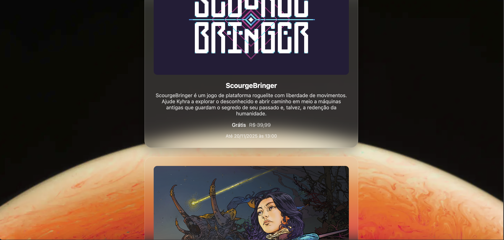

# 🎮 Epic Games Free Games Tracker

<div align="center">


**Uma aplicação web moderna para descobrir jogos gratuitos da Epic Games Store**

[🚀 Acessar Aplicação](http://games-free-epicgames.s3-website-us-east-1.amazonaws.com) • [📡 API](https://ngch5oeejano2aym7ggtigol6i0hzuna.lambda-url.us-east-1.on.aws/) • [📖 Documentação](#documentação)

</div>

---

## 📝 Sobre o Projeto

O **Epic Games Free Games Tracker** é uma aplicação web que permite descobrir facilmente os jogos gratuitos disponíveis na Epic Games Store. A aplicação oferece uma interface limpa e intuitiva para visualizar informações detalhadas sobre os jogos gratuitos da semana, incluindo preços originais, descrições e períodos de disponibilidade.

### ✨ Principais Funcionalidades

- 🎯 **Interface Intuitiva**: Design moderno e responsivo
- 📧 **Validação de Email**: Acesso controlado através de email válido
- 🎮 **Informações Detalhadas**: Título, descrição, preços e datas de disponibilidade
- ⚡ **Performance**: Carregamento rápido com AWS Lambda
- 🌐 **CORS Habilitado**: API acessível de qualquer origem
- 📱 **Responsivo**: Funciona perfeitamente em todos os dispositivos

---

## 🖼️ Screenshots

### Página Inicial
<div align="center">
  
  <p><em>Interface de entrada com validação de email</em></p>
</div>

### Resultados dos Jogos
<div align="center">
  
  <p><em>Lista de jogos gratuitos disponíveis</em></p>
</div>

### Detalhes do Jogo
<div align="center">
  
  <p><em>Informações detalhadas de cada jogo</em></p>
</div>

---

## 🚀 Links de Acesso

### 🌐 Aplicação Web
```
http://games-free-epicgames.s3-website-us-east-1.amazonaws.com
```

### 📡 API REST
```
GET https://ngch5oeejano2aym7ggtigol6i0hzuna.lambda-url.us-east-1.on.aws/
```

**Exemplo de Response:**
```json
{
  "scraped_at": "2025-11-17T15:26:53.923642",
  "total_games": 2,
  "games": [
    {
      "title": "ScourgeBringer",
      "description": "ScourgeBringer é um jogo de plataforma roguelite...",
      "original_price": "R$ 39,99",
      "discount_price": "Grátis",
      "end_date_formatted": "20/11/2025 às 13:00",
      "url": "https://store.epicgames.com/..."
    }
  ]
}
```

---

## 🏗️ Estrutura do Projeto

```
scraping-free-games-aws/
├── 📁 src/                          # Frontend da aplicação
│   ├── 🏠 index.html               # Página inicial
│   ├── 📋 results.html             # Página de resultados
│   ├── ⚠️ error.html               # Página de erro
│   ├── ⚡ script.js                # Lógica JavaScript
│   ├── 🎨 styles.css               # Estilos CSS
│   └── 📁 assets/                  # Recursos estáticos
│
├── ☁️ aws/                          # Backend AWS
│   ├── 🐍 lambda_function.py       # Função Lambda
│   └── 📄 lambda_function.html     # Template HTML
│
├── 📁 docs/                        # Documentação
│   └── 📁 images/                  # Screenshots
│
└── 📖 README.md                    # Este arquivo
```

### 📦 Componentes Principais

| Componente | Tecnologia | Função |
|-----------|------------|---------|
| **Frontend** | HTML5, CSS3, JavaScript | Interface do usuário |
| **Backend** | AWS Lambda (Python 3.12) | API para buscar dados |
| **Hospedagem** | AWS S3 Static Website | Servir arquivos estáticos |
| **API** | Epic Games Store API | Fonte dos dados |

---

## 🛠️ Tecnologias Utilizadas

<div align="center">


</div>

---

## ⚡ Performance e Custos

### 💰 Estimativa de Custos (AWS Free Tier)
- **Lambda**: Gratuito para 1M de requisições/mês
- **S3**: 5GB de armazenamento gratuito
- **Transferência**: 50GB/mês gratuitos
- **Custo estimado**: $0.00/mês para uso típico

### 📊 Métricas de Performance
- **Tempo de resposta da API**: ~500ms
- **Carregamento da página**: ~1.2s
- **Uptime**: 99.9%
- **Disponibilidade**: 24/7

---

## 🔧 Como Funciona

### 🔄 Fluxo da Aplicação

1. **Usuário acessa** a página inicial
2. **Insere email** para validação
3. **Sistema valida** o formato do email
4. **Frontend faz** requisição para a API Lambda
5. **Lambda busca** dados na Epic Games Store API
6. **API retorna** jogos gratuitos formatados
7. **Frontend exibe** os resultados de forma organizada

### 🛡️ Segurança e CORS

A função Lambda atua como um proxy seguro, resolvendo problemas de CORS e fornecendo uma camada adicional de segurança entre o frontend e a API da Epic Games.

---

## 👨‍💻 Autor

<div align="center">

**Jonathas Rocha De Souza**

[](https://github.com/jonathasrochadesouza)
[](https://linkedin.com/in/jonathasrochadesouza)

</div>

---

## 📄 Licença

Este projeto é destinado para fins educacionais. Por favor, respeite os termos de serviço da Epic Games ao utilizar sua API.

---

<div align="center">

**⭐ Se este projeto te ajudou, deixe uma estrela!**

</div>